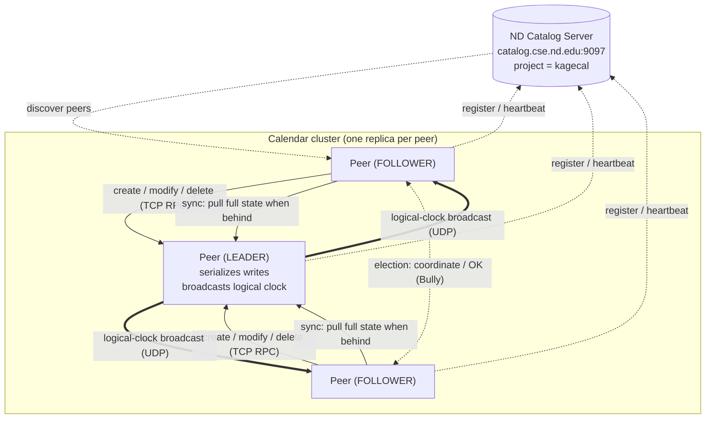
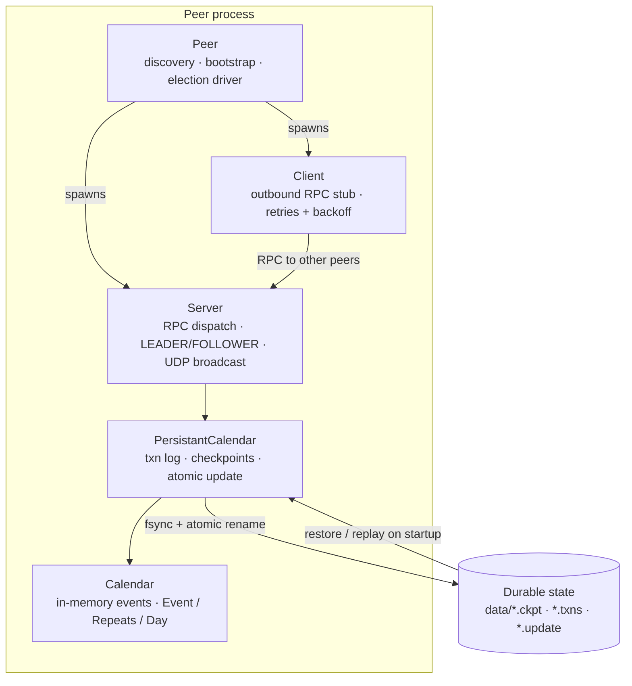

# Kagecal

**Kagecal** is a decentralized, peer-to-peer calendar. Every participant runs a
full replica of a shared calendar, and the peers coordinate among themselves to
keep those replicas consistent, there is no central server that owns the data.
Peers elect a leader to serialize writes, replicate state to followers, and
automatically recover and re-elect when the leader disappears.

 **Team**: Sam Neisewander, Leonardo Molina
 **Course**: [CSE 40771 - Distributed Systems](https://dthain.github.io/distsys-sp26/), Spring 2026

## Architecture

| Component | Responsibility |
| --- | --- |
| `Calendar` | In-memory event store and the `Event` / `Repeats` / `Day` data model, including event validation and content hashing. |
| `PersistantCalendar` | Durable layer on top of `Calendar`: write-ahead transaction log, checkpoints, and atomic full-state updates. |
| `Server` | TCP RPC server handling `create` / `delete` / `modify` / `sync` / `who_is_leader` / `coordinate` / `election`; runs in either `LEADER` or `FOLLOWER` mode and broadcasts its logical clock. |
| `Client` | RPC stub used to call another peer's server, with retries and backoff. |
| `Peer` | Ties it all together: spawns the server and election threads, discovers peers via the catalog, bootstraps as leader or follower, and drives leader election. |

Writes flow to the leader, which logs and replicates them; followers stay in
sync by comparing the leader's broadcast logical clock against their own and
pulling a full update when needed. When the leader stops responding, any peer
that notices triggers an election to choose a new one.

### Cluster topology

Peers discover one another through the ND catalog, route writes to the elected
leader over TCP, and learn when to re-sync from the leader's UDP clock
broadcasts.



### Peer internals

Each peer is a single process that runs a server thread and an election thread
over a durable, checkpointed calendar.



## Repository Structure

```bash
.
├── kagecal                     # Entry point — interactive CLI shell
├── DistributedCalendar/        # Core package
│   ├── Calendar.py             # Event model + in-memory calendar
│   ├── PersistantCalendar.py   # Transaction log + checkpoint layer
│   ├── Server.py               # RPC server, leader/follower logic, broadcast
│   ├── Client.py               # RPC client stub
│   ├── Peer.py                 # Peer coordination, discovery, election
│   └── __init__.py             # Package exports
├── scripts/                    # Benchmark / setup utilities
│   ├── spawn.py                #   Spawn N peers and measure write latency
│   ├── setup_calendar.py       #   Generate random events / checkpoints
│   ├── sink.py                 #   Result collection helper
│   └── results.py              #   Build latency / throughput graphs
├── tests/                      # Unit and integration tests (pytest)
├── docs/                       # Report, proposal, development log, graphs
├── birthday.cal                # Example exported event
└── requirements.txt            # Dependencies
```

## Requirements

```bash
python3 -m venv .venv
source .venv/bin/activate
pip install -r requirements.txt
```

## Usage

Start the interactive shell:

```bash
./kagecal
```

Inside the shell:

```text
kagecal> join my-calendar     # Join (or create) a calendar; prompts for a peer identifier
kagecal> create               # Interactively create an event (or: create -f event.cal)
kagecal> list                 # List all events in the active calendar
kagecal> show   <event-id>    # Show full details of an event
kagecal> modify <event-id>    # Edit an event
kagecal> remove <event-id>    # Delete an event
kagecal> dump   <event-id> f  # Export an event to a file
kagecal> switch other-cal     # Switch the active calendar
kagecal> clear                # Clear the terminal
kagecal> help                 # List commands (CTRL-D to exit)
```

## Testing

```bash
pytest
```

## Benchmarking

The `scripts/` directory contains utilities used to measure write latency and
throughput as the number of peers scales. For example, spawn several peers that
each submit random events and record per-event timings:

```bash
python scripts/spawn.py --peers 4 --events 16 --calendar-ident bench
```

Generated graphs (`docs/latency_graph.png`, `docs/throughput_graph.png`) and the
write-up in `docs/` summarize the results.

## License

Academic project for CSE 40771. Do not distribute or copy without permission.

---

_This project follows the structure and guidelines provided by the CSE 40771 course materials._
